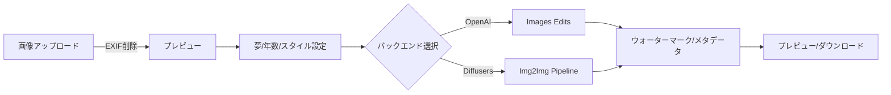

# Creative Future Portrait — 仕様書 v1.0（Streamlit版）

* **文書種別**: 製品仕様書（MVP）
* **対象**: 企画 / 開発 / 法務 / 運用
* **作成日**: 2025-09-06 (JST)
* **版数**: v1.0
* **作成者**: niikun + ChatGPT
* **状態**: MVP要件確定 / 実装済みプロトタイプあり（Streamlit app.py）

---

## 1. 概要（Executive Summary）

子どもの「現在の写真」と「将来の夢（テキスト）」を入力し、**20年後の本人らしい姿**を“**創作イメージ**”として生成するアプリ。**予測ではなく創作**であることを明示し、**保護者に安心感**を提供しながら、**進路理解・家族の対話**を促す体験を提供する。商用展開（B2C / B2B / イベント）を見据え、**安全・法令順守・データ最小化**を中核設計に据える。

---

## 2. 目的 / 非目的

**目的**

* 子どもの将来の夢をもとに、前向きで安全な“未来の自分”イメージを生成・共有できる体験を提供する。
* 顔IDの一貫性と安全性のバランスを取りつつ、**保護者が安心できるUI/文言**で運用する。

**非目的**

* 科学的な顔年齢予測・犯罪捜査・バイオメトリクス照合用途。
* 未承諾の第三者・著名人の顔画像利用。
* NSFW/攻撃的/ブランド毀損/差別的な出力の許容。

---

## 3. ユースケース / 主要ステークホルダー

* **家庭向け（B2C）**: 記念画像の生成・フォトブック/ポストカード化。
* **イベント（B2B/B2G）**: 自治体/教育イベントでの職業体験ブース。
* **教育現場**: 将来の職業理解の補助教材（創作イメージとして）。

ステークホルダー: 保護者・子ども、運営者、法務、CS、イベントオペレーター、提携先（印刷/EC）。

---

## 4. 用語定義

* **創作イメージ**: 未来予測ではなく、AI生成による架空のビジュアル表現。
* **ID保持**: 元画像の顔特徴（骨格/ほくろ等）を保ったまま生成する性質。
* **可視ウォーターマーク**: 画像内に明示的に表示する「創作」透かし。
* **不可視メタデータ**: PNGテキストチャンク等に埋め込む出自情報。

---

## 5. スコープ（MVP）

* 画像アップロード（1枚）/ EXIF削除 / 方向補正
* 20年後の創作イメージ生成（**写実 / やわらか写実 / イラスト**）
* 夢テキスト→プロンプト化（衣装/背景/小物のヒント）
* OpenAI Images **または** Diffusers（ローカル）による生成
* 可視ウォーターマーク + PNGメタデータ埋め込み（任意）
* 画像保存は**デフォルトでしない**（ダウンロードのみ）
* 簡易コンテンツ安全（負例プロンプト / 注意文言）

**非スコープ（Phase2以降）**

* InstantID / IP-Adapter による強いID保持
* 年齢進行LoRAの自社学習
* NSFW/商標/制服検知のモデル化
* 保護者同意UIの署名/ログ保管、アカウント機能
* イベント向けキオスクモード、A4自動レイアウト

---

## 6. 機能要件（FR）

| ID     | 項目       | 要件                            | 受入基準                                |
| ------ | -------- | ----------------------------- | ----------------------------------- |
| FR-001 | 画像アップロード | JPG/PNG 1枚、5〜20MB想定           | 不正拡張子は拒否、EXIF削除後にプレビュー表示            |
| FR-002 | 夢入力      | テキスト入力（50文字以内目安）              | 未入力時はプレースホルダを用意                     |
| FR-003 | 年数指定     | +5〜+40年のスライダ                  | 既定値は+20年                            |
| FR-004 | スタイル選択   | やわらか写実/写実/イラスト                | 既定はやわらか写実                           |
| FR-005 | 生成       | OpenAI or Diffusersを選択して生成    | 60秒以内に結果が表示される（参考目標）                |
| FR-006 | 安全制御     | 負例プロンプト、注意文言、NSFW的キーワード抑制     | NSFW/暴力/飲酒喫煙/ロゴ等が高頻度で混入しない          |
| FR-007 | ウォーターマーク | 右下に「創作/日付」透かしを付与（ON/OFF可）     | 文言と日付が読める                           |
| FR-008 | メタデータ    | PNGにテキストチャンクで出自情報埋め込み（ON/OFF） | `X-Notice`/`X-Generated-At` 等が格納される |
| FR-009 | ダウンロード   | 生成画像をPNGで保存                   | クリックで即DL                            |
| FR-010 | データ保持    | 既定で**サーバ保存しない**               | 実装確認（サーバ側に残存なし）                     |

---

## 7. 非機能要件（NFR）

* **性能**: 単発生成 1024px で P50 < 30s（OpenAI）/ < 45s（Diffusers, GPU）。
* **可用性**: デモ構成はSLA対象外。将来の商用運用ではSLO: 99.5%を目標。
* **セキュリティ**: 通信TLS、サーバ側で画像を永続保存しない方針、署名付URL（将来分離時）。
* **プライバシー**: データ最小化/目的限定。EXIF除去。オプトイン以外での保存禁止。
* **法令**: APPI/GDPR/COPPA を想定。DPIA/PIAは商用化時に実施。
* **可観測性**: 画像本体はログしない。メタデータ最小（生成時間/失敗理由/モデル名）。

---

## 8. 画面 / UXフロー（MVP）

1. 写真アップロード（EXIF自動削除→プレビュー）
2. 夢テキスト入力 / 年数スライダ / スタイル選択
3. 生成ボタン → スピナー表示 → 出力プレビュー
4. 透かし（ON/OFF）、PNGメタデータ（ON/OFF）
5. ダウンロード（PNG）

---

## 9. データ仕様

**入力**: ユーザー画像（RGB, \~1024pxに収める）、夢テキスト（UTF-8）。

**内部処理**: PIL Image (in-memory)。EXIFは削除。

**出力**: PNG（既定 1024×1024）。

* 可視透かしテキスト例: `Creative Future Portrait — YYYY-MM-DD (Not a real prediction)`
* PNGテキストチャンク例（任意）:

  * `X-Notice`: "This is a creative, AI-generated future portrait (not a prediction)."
  * `X-Generated-At`: ISO8601
  * `X-Backend`: openai | diffusers
  * `X-Years`: 数値
  * `X-Dream`: 入力文字列
  * `X-Style`: 選択肢

**保持方針**: 生成後はセッション終了と同時にメモリ解放。サーバ保存はしない。

---

## 10. 設定 / 環境変数

* `OPENAI_API_KEY`: OpenAI利用時に必須
* `BACKEND`: `openai` | `diffusers`（UIで上書き可能）
* `DIFFUSERS_MODEL`: 例 `stabilityai/sdxl-turbo`

依存: `streamlit`, `pillow`, `numpy`, `python-dotenv`, `openai`（任意）, `torch`+`diffusers`（任意）

---

## 11. 生成ロジック（要点）

* **プロンプト合成**: 夢テキスト + 年数(+20年) + スタイルの文言
* **負例**: NSFW/暴力/ロゴ/喫煙飲酒/変形 等を抑制
* **OpenAI**: `images.edits` を想定（完全なID保持は非保証）。
* **Diffusers**: SD / SDXL 画像to画像。`strength`を低めにしID維持を補助。
* **ポストプロセス**: ウォーターマーク合成、PNGメタ付与

---

## 12. バックエンド仕様

### 12.1 OpenAI Images

* **長所**: 導入容易、速度安定
* **弱点**: ID保持の強制度は限定的 / API規約に従う

### 12.2 Diffusers（ローカル）

* **長所**: 柔軟・改変自由、将来のInstantID/IP-Adapter統合が容易
* **弱点**: GPU必須、初期モデル選定/安全設計が必要

将来: \*\*ID Adapter（InstantID/IP-Adapter）\*\*の導入で顔一貫性を強化。年齢LoRAの自社学習を検討。

---

## 13. セキュリティ / プライバシー

* **EXIF削除**: 位置情報等の除去。
* **データ最小化**: 画像はメモリのみ。保存デフォルトOFF。
* **通信保護**: HTTPS（本番）/ CSRF不要（単一ページ）
* **権限**: 管理画面なし（MVP）。
* **脅威例（簡易）**: 画像持ち去り → 保存禁止/署名付DL（将来）。Prompt injection → プロンプト定型化。

---

## 14. 法令・ポリシー

* **APPI**: 顔画像=個人情報。目的限定/同意/開示・削除対応が必要（商用化時）。
* **GDPR/COPPA**: EU/米対象ユーザー取得時はDPIA/保護者同意を要する。
* **規約/PP**: 創作である旨、保存方針、第三者提供なし、削除請求導線。
* **ライセンス**: モデル/LoRA/フォント/アイコンを**商用可**に限定。出所台帳を保持。

---

## 15. コンテンツ安全ポリシー

* 禁止: NSFW、過度な露出、暴力/武器、飲酒/喫煙、ブランドロゴ/校章/制服など特定性の高い要素。
* 制御: 負例プロンプト + UI注意 + 将来は自動検知（CLIP+軽量分類器）。
* コピーライト: 著名人/キャラ類似の再現は禁止。

---

## 16. ロギング / 監査

* **収集**: 成否、処理時間、モデルID、エラー種別。
* **非収集**: 画像・顔埋め込み・夢テキストの永続化（MVP）。
* 監査: 運用時はアクセスログ（IPは短期保持）、削除請求対応の台帳（別DB）。

---

## 17. ウォーターマーク仕様

* 右下/半透明プレートにテキスト: `Creative Future Portrait — YYYY-MM-DD (Not a real prediction)`
* 透明度: 約140（RGBA）/ 角丸背景プレート。
* 不可視: PNGテキストチャンクに由来情報（ON/OFF）。

---

## 18. 性能/インフラ要件（目安）

* ローカルMVP: 単一GPU（8–16GB）で1ジョブ同時実行。
* クラウド（将来）: 推論ワーカー水平スケール、ジョブキュー化。
* ストレージ: 永続化なし。DL生成のみ。

---

## 19. テスト計画（抜粋）

**ユニット**: EXIF削除、ウォーターマーク描画、PNGメタ付与。

**E2E**: 代表画像×5（屋内/屋外/光条件差）×スタイル3 × バックエンド2。

* 期待: 顔の連続性（目視OK閾値）、不適切要素が混入しない。

**アクセシビリティ**: スクリーンリーダ/コントラスト確保（将来）。

---

## 20. 運用 / 監視（将来）

* 指標: 生成成功率、P50/P95レイテンシ、NSFW検知率、DL率。
* アラート: 連続失敗、レイテンシ悪化。

---

## 21. リリース計画

* **MVP（本書）**: Streamlit単体。OpenAI/Diffusers切替。保存なし。
* **Phase 2**: ID Adapter統合、年齢LoRA、自動検知、同意UI、キオスク。
* **Phase 3**: アカウント/課金、印刷EC連携、国際対応、SLO整備。

---

## 22. 既知リスク / 対応

* **ID一貫性が弱い**: Phase2でInstantID等導入。
* **不適切混入**: 負例+将来の検知強化。
* **法令対応**: 商用化時にDPIA/弁護士レビュー必須。

---

## 23. 変更履歴

* v1.0 (2025-09-06): MVP仕様初版作成（Streamlit実装に準拠）

---

## 参考：実装ファイル

* `app.py`（Streamlitアプリ本体）
* `.env`（任意）：`OPENAI_API_KEY`, `BACKEND`, `DIFFUSERS_MODEL`

> 注: 本仕様はMVP用途。商用化時は法務/セキュリティ/インフラ要件を別紙で精緻化のこと。
